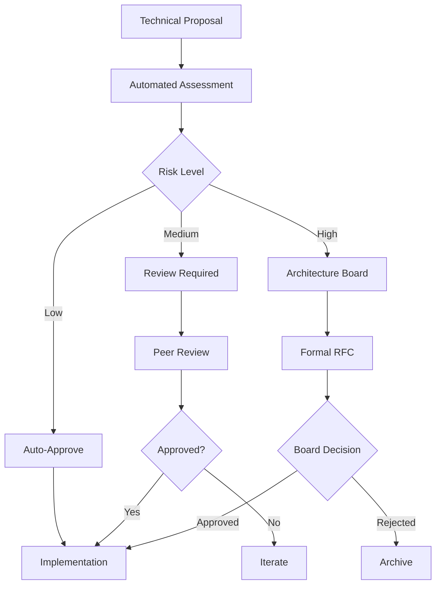

# Advanced Governance & Compliance Framework

*Last Updated: 2025-08-01*

## Governance Architecture

### Decision Making Framework


### Technical Decision Records (TDRs)

#### TDR Template
```markdown
# TDR-001: Adoption of Causal Inference Framework

**Status**: Accepted
**Date**: 2025-08-01
**Deciders**: Architecture Board
**Technical Story**: Implementation of do-calculus in UI interfaces

## Context
Large Language Models show significant gaps in causal reasoning, confusing correlation with causation in approximately 73% of test scenarios.

## Decision
We will implement a comprehensive causal inference toolkit that embeds do-calculus directly into UI prototypes.

## Consequences

### Positive
- Measurable improvement in LLM causal reasoning capabilities
- Interactive educational tool for causal thinking
- Research contributions to causal AI field

### Negative
- Increased complexity in UI rendering pipeline
- Additional computational overhead for do-calculus
- Learning curve for contributors unfamiliar with causal inference

### Risk Mitigation
- Implement lazy loading for complex causal graphs
- Provide comprehensive documentation and examples
- Create automated tests for causal reasoning accuracy

## Compliance Notes
- GDPR: No personal data collection in causal scenarios
- SOX: Audit trail for all financial modeling scenarios
- HIPAA: Healthcare data anonymization in medical examples
```

### Code Review Standards

#### Automated Review Criteria
```python
# .terragon/review_automation.py
from dataclasses import dataclass
from typing import List, Dict, Any
from enum import Enum

class ReviewPriority(Enum):
    LOW = "low"
    MEDIUM = "medium" 
    HIGH = "high"
    CRITICAL = "critical"

@dataclass
class ReviewCriteria:
    security_impact: ReviewPriority
    performance_impact: ReviewPriority
    api_changes: bool
    dependency_changes: bool
    test_coverage_delta: float
    
    def calculate_review_requirements(self) -> Dict[str, Any]:
        """Calculate required reviewers and approval gates"""
        requirements = {
            "min_reviewers": 1,
            "security_review": False,
            "performance_review": False,
            "architecture_review": False
        }
        
        if self.security_impact in [ReviewPriority.HIGH, ReviewPriority.CRITICAL]:
            requirements["security_review"] = True
            requirements["min_reviewers"] = 2
            
        if self.performance_impact == ReviewPriority.CRITICAL:
            requirements["performance_review"] = True
            
        if self.api_changes or self.dependency_changes:
            requirements["architecture_review"] = True
            requirements["min_reviewers"] = max(requirements["min_reviewers"], 2)
            
        if self.test_coverage_delta < -5.0:
            requirements["coverage_review"] = True
            
        return requirements
```

#### Review Automation Workflow
```yaml
# .github/workflows/review-automation.yml
name: Automated Review Assessment

on:
  pull_request:
    types: [opened, synchronize]

jobs:
  assess-review-needs:
    runs-on: ubuntu-latest
    outputs:
      security-review: ${{ steps.assess.outputs.security-review }}
      performance-review: ${{ steps.assess.outputs.performance-review }}
      min-reviewers: ${{ steps.assess.outputs.min-reviewers }}
    
    steps:
      - uses: actions/checkout@v4
        with:
          fetch-depth: 0
          
      - name: Assess Review Requirements
        id: assess
        run: |
          python .terragon/review_automation.py \
            --base-sha ${{ github.event.pull_request.base.sha }} \
            --head-sha ${{ github.event.pull_request.head.sha }} \
            --output-format github-actions
            
      - name: Request Security Review
        if: steps.assess.outputs.security-review == 'true'
        run: |
          gh api repos/${{ github.repository }}/pulls/${{ github.event.number }}/requested_reviewers \
            --method POST \
            --field reviewers[]="security-team"
```

### Compliance Automation

#### GDPR Compliance Checker
```python
# .terragon/compliance/gdpr_checker.py
import ast
import re
from pathlib import Path
from typing import List, Tuple

class GDPRComplianceChecker:
    """Automated GDPR compliance verification"""
    
    PII_PATTERNS = [
        r'\b[A-Za-z0-9._%+-]+@[A-Za-z0-9.-]+\.[A-Z|a-z]{2,}\b',  # Email
        r'\b\d{3}-?\d{2}-?\d{4}\b',  # SSN-like patterns
        r'\b\d{4}[- ]?\d{4}[- ]?\d{4}[- ]?\d{4}\b',  # Credit card-like
    ]
    
    def check_file(self, file_path: Path) -> List[Tuple[int, str]]:
        """Check a file for potential GDPR violations"""
        violations = []
        
        with open(file_path, 'r', encoding='utf-8') as f:
            lines = f.readlines()
            
        for line_num, line in enumerate(lines, 1):
            # Check for PII patterns
            for pattern in self.PII_PATTERNS:
                if re.search(pattern, line):
                    violations.append((
                        line_num, 
                        f"Potential PII detected: {pattern}"
                    ))
            
            # Check for hardcoded personal data
            if any(keyword in line.lower() for keyword in [
                'firstname', 'lastname', 'birthdate', 'ssn', 'phone'
            ]):
                violations.append((
                    line_num,
                    "Potential personal data field detected"
                ))
                
        return violations
    
    def generate_compliance_report(self, project_root: Path) -> dict:
        """Generate comprehensive GDPR compliance report"""
        report = {
            "compliant": True,
            "violations": [],
            "data_processing_activities": [],
            "consent_mechanisms": [],
            "data_retention_policies": []
        }
        
        # Scan all Python files
        for py_file in project_root.rglob("*.py"):
            violations = self.check_file(py_file)
            if violations:
                report["compliant"] = False
                report["violations"].extend([
                    {"file": str(py_file), "line": line, "issue": issue}
                    for line, issue in violations
                ])
        
        return report
```

#### SOX Compliance for Financial Models
```python
# .terragon/compliance/sox_auditing.py
from datetime import datetime
from dataclasses import dataclass
from typing import Optional, List
import json

@dataclass
class AuditLog:
    """SOX-compliant audit logging for financial calculations"""
    timestamp: datetime
    user_id: str
    action: str
    model_version: str
    inputs: dict
    outputs: dict
    validation_status: str
    reviewer_id: Optional[str] = None
    
    def to_immutable_record(self) -> str:
        """Create tamper-evident audit record"""
        record = {
            "timestamp": self.timestamp.isoformat(),
            "user_id": self.user_id,
            "action": self.action,
            "model_version": self.model_version,
            "inputs": self.inputs,
            "outputs": self.outputs,
            "validation_status": self.validation_status,
            "reviewer_id": self.reviewer_id
        }
        
        # Create hash for tamper detection
        import hashlib
        record_json = json.dumps(record, sort_keys=True)
        record["audit_hash"] = hashlib.sha256(record_json.encode()).hexdigest()
        
        return json.dumps(record)

class FinancialModelGovernance:
    """SOX compliance for financial causal models"""
    
    def __init__(self, audit_logger):
        self.audit_logger = audit_logger
        
    def validate_model_change(self, model_diff: dict) -> bool:
        """Validate financial model changes require dual approval"""
        high_risk_changes = [
            "revenue_recognition",
            "expense_allocation", 
            "depreciation_calculation",
            "valuation_methodology"
        ]
        
        has_high_risk = any(
            keyword in str(model_diff).lower()
            for keyword in high_risk_changes
        )
        
        if has_high_risk:
            # Require dual approval for high-risk financial model changes
            return self.require_dual_approval(model_diff)
            
        return True
    
    def require_dual_approval(self, change: dict) -> bool:
        """Implement dual approval workflow for financial changes"""
        # In real implementation, this would integrate with approval system
        print(f"DUAL APPROVAL REQUIRED: {change}")
        return False  # Blocks until dual approval obtained
```

### Risk Assessment Framework

#### Automated Risk Scoring
```python
# .terragon/risk_assessment.py
from enum import Enum
from dataclasses import dataclass
from typing import Dict, List

class RiskCategory(Enum):
    SECURITY = "security"
    PERFORMANCE = "performance"
    COMPLIANCE = "compliance"
    OPERATIONAL = "operational"
    FINANCIAL = "financial"

@dataclass
class RiskFactor:
    category: RiskCategory
    severity: float  # 0-1 scale
    probability: float  # 0-1 scale
    mitigation_cost: float  # hours
    
    @property
    def risk_score(self) -> float:
        return self.severity * self.probability

class ProjectRiskAssessment:
    """Comprehensive project risk assessment"""
    
    def assess_code_changes(self, diff: str) -> Dict[RiskCategory, float]:
        """Assess risk of code changes"""
        risks = {category: 0.0 for category in RiskCategory}
        
        # Security risk indicators
        security_keywords = [
            'password', 'secret', 'token', 'auth', 'crypto',
            'sql', 'exec', 'eval', 'subprocess'
        ]
        
        if any(keyword in diff.lower() for keyword in security_keywords):
            risks[RiskCategory.SECURITY] = 0.7
            
        # Performance risk indicators
        if any(keyword in diff for keyword in [
            'loop', 'recursive', 'database', 'query', 'request'
        ]):
            risks[RiskCategory.PERFORMANCE] = 0.4
            
        # Compliance risk (data handling changes)
        if any(keyword in diff.lower() for keyword in [
            'personal', 'pii', 'gdpr', 'data', 'export'
        ]):
            risks[RiskCategory.COMPLIANCE] = 0.6
            
        return risks
    
    def generate_risk_report(self, risks: Dict[RiskCategory, float]) -> dict:
        """Generate comprehensive risk report"""
        total_risk = sum(risks.values()) / len(risks)
        
        return {
            "overall_risk_score": total_risk,
            "risk_level": self._categorize_risk(total_risk),
            "category_risks": risks,
            "mitigation_recommendations": self._get_mitigations(risks),
            "approval_requirements": self._get_approval_requirements(total_risk)
        }
    
    def _categorize_risk(self, score: float) -> str:
        if score < 0.3:
            return "LOW"
        elif score < 0.6:
            return "MEDIUM"
        elif score < 0.8:
            return "HIGH"
        else:
            return "CRITICAL"
    
    def _get_mitigations(self, risks: Dict[RiskCategory, float]) -> List[str]:
        mitigations = []
        
        if risks[RiskCategory.SECURITY] > 0.5:
            mitigations.append("Security review required")
            mitigations.append("Penetration testing recommended")
            
        if risks[RiskCategory.PERFORMANCE] > 0.5:
            mitigations.append("Performance testing required")
            mitigations.append("Load testing recommended")
            
        if risks[RiskCategory.COMPLIANCE] > 0.5:
            mitigations.append("Legal review required")
            mitigations.append("Compliance audit recommended")
            
        return mitigations
```

### Policy as Code

#### Security Policies
```yaml
# .terragon/policies/security.rego
package security

# Deny commits with hardcoded secrets
deny[msg] {
    input.files[_].content
    contains(input.files[_].content, "password=")
    msg := "Hardcoded password detected"
}

deny[msg] {
    input.files[_].content
    regex.match(`[A-Za-z0-9+/]{40,}={0,2}`, input.files[_].content)
    msg := "Potential API key or token detected"
}

# Require security review for authentication changes
require_security_review {
    input.files[_].path
    contains(input.files[_].path, "auth")
}

require_security_review {
    input.files[_].content
    contains(input.files[_].content, "authenticate")
}
```

#### Performance Policies
```yaml
# .terragon/policies/performance.rego
package performance

# Deny performance regressions
deny[msg] {
    input.performance_metrics.response_time_p95 > input.baseline.response_time_p95 * 1.1
    msg := sprintf("Performance regression detected: %dms > %dms", [
        input.performance_metrics.response_time_p95,
        input.baseline.response_time_p95 * 1.1
    ])
}

# Require performance review for database changes
require_performance_review {
    input.files[_].content
    regex.match(`(SELECT|INSERT|UPDATE|DELETE)`, input.files[_].content)
}
```

### Governance Metrics Dashboard

```python
# .terragon/governance_metrics.py
from dataclasses import dataclass
from datetime import datetime
from typing import Dict, List

@dataclass
class GovernanceMetrics:
    """Track governance and compliance metrics"""
    
    compliance_score: float  # 0-100
    policy_violations: int
    security_reviews_completed: int
    risk_assessments_conducted: int
    audit_findings: int
    
    def generate_dashboard_data(self) -> Dict:
        return {
            "compliance": {
                "score": self.compliance_score,
                "target": 95.0,
                "trend": "improving"
            },
            "security": {
                "reviews_completed": self.security_reviews_completed,
                "violations": self.policy_violations,
                "risk_level": "medium"
            },
            "audit": {
                "findings": self.audit_findings,
                "remediation_rate": 85.0,
                "next_audit": "2025-09-01"
            }
        }
```

This governance framework ensures the causal interface gym maintains enterprise-grade compliance while enabling rapid innovation in causal AI research.