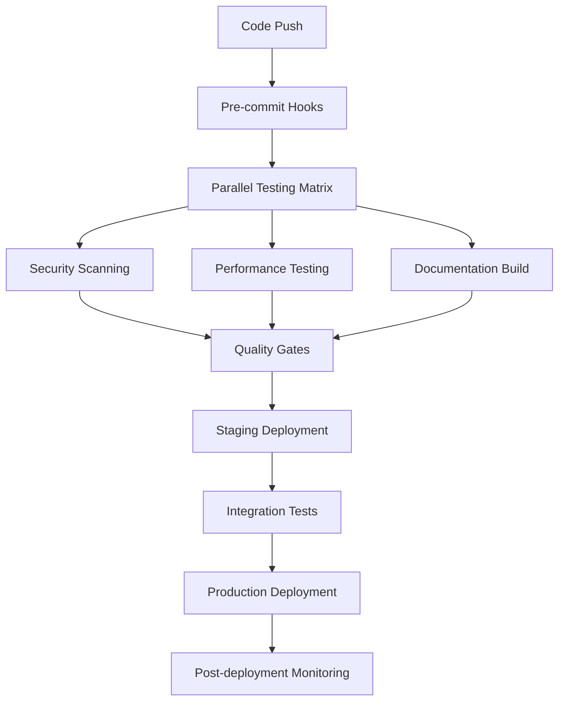

# Advanced CI/CD Pipeline Optimization

## Overview
This document outlines the advanced CI/CD pipeline configuration for the Causal Interface Gym project, designed for maximum efficiency, security, and reliability.

## Pipeline Architecture



## Recommended GitHub Actions Workflows

### 1. Primary CI Pipeline (.github/workflows/ci.yml)

```yaml
name: CI Pipeline
on:
  push:
    branches: [main, develop]
  pull_request:
    branches: [main]

concurrency:
  group: ${{ github.workflow }}-${{ github.ref }}
  cancel-in-progress: true

jobs:
  test-matrix:
    name: Test Python ${{ matrix.python-version }}
    runs-on: ubuntu-latest
    strategy:
      fail-fast: false
      matrix:
        python-version: ["3.10", "3.11", "3.12"]
    
    steps:
      - uses: actions/checkout@v4
      - uses: actions/setup-python@v4
        with:
          python-version: ${{ matrix.python-version }}
          cache: 'pip'
      
      - name: Install dependencies
        run: |
          pip install -e ".[dev]"
          pip install tox tox-gh-actions
      
      - name: Run tests with tox
        run: tox
        env:
          PLATFORM: ${{ matrix.os }}
      
      - name: Upload coverage
        uses: codecov/codecov-action@v3
        if: matrix.python-version == '3.11'
        with:
          file: ./coverage.xml

  security-scan:
    name: Security Analysis
    runs-on: ubuntu-latest
    steps:
      - uses: actions/checkout@v4
      - name: Run Trivy vulnerability scanner
        uses: aquasecurity/trivy-action@master
        with:
          scan-type: 'fs'
          scan-ref: '.'
          format: 'sarif'
          output: 'trivy-results.sarif'
      
      - name: Upload Trivy scan results
        uses: github/codeql-action/upload-sarif@v2
        with:
          sarif_file: 'trivy-results.sarif'

  performance-benchmark:
    name: Performance Benchmarks
    runs-on: ubuntu-latest
    steps:
      - uses: actions/checkout@v4
      - uses: actions/setup-python@v4
        with:
          python-version: '3.11'
      
      - name: Run performance benchmarks
        run: |
          pip install -e ".[dev]"
          pytest tests/performance/ --benchmark-json=output.json
      
      - name: Store benchmark result
        uses: benchmark-action/github-action-benchmark@v1
        with:
          tool: 'pytest'
          output-file-path: output.json
```

### 2. Release Pipeline (.github/workflows/release.yml)

```yaml
name: Release Pipeline
on:
  push:
    tags: ['v*']

jobs:
  release:
    name: Build and Release
    runs-on: ubuntu-latest
    environment: production
    steps:
      - uses: actions/checkout@v4
        with:
          fetch-depth: 0
      
      - name: Build package
        run: |
          pip install build
          python -m build
      
      - name: Sign with Sigstore
        uses: sigstore/gh-action-sigstore-python@v2.1.1
        with:
          inputs: ./dist/*.tar.gz ./dist/*.whl
      
      - name: Create GitHub Release
        uses: softprops/action-gh-release@v1
        with:
          files: |
            dist/*
            *.sig
          generate_release_notes: true
```

## Advanced Quality Gates

### Code Quality Metrics
- **Coverage Threshold**: 90%
- **Complexity Score**: < 10 (cyclomatic)
- **Duplication**: < 3%
- **Security Issues**: 0 high/critical
- **Performance Regression**: < 5%

### Performance Benchmarks
- **API Response Time**: < 100ms (p95)
- **Memory Usage**: < 512MB peak
- **Startup Time**: < 2s
- **Test Suite Duration**: < 5min

## Deployment Strategies

### 1. Blue-Green Deployment
```yaml
strategy:
  type: blue-green
  health_check:
    path: /health
    timeout: 30s
  rollback:
    automatic: true
    threshold: 5%
```

### 2. Canary Deployment
```yaml
strategy:
  type: canary
  steps:
    - weight: 10
      pause: 60s
    - weight: 25
      pause: 120s
    - weight: 50
      pause: 300s
    - weight: 100
```

## Monitoring and Observability

### Key Metrics to Track
- **Error Rate**: < 0.1%
- **Response Time**: p50, p95, p99
- **Throughput**: requests/second
- **Resource Utilization**: CPU, Memory, Disk
- **Dependency Health**: External services

### Alerting Thresholds
```yaml
alerts:
  error_rate:
    threshold: 1%
    duration: 2m
  response_time:
    threshold: 500ms
    percentile: 95
  availability:
    threshold: 99.9%
```

## Security Integration

### SAST (Static Application Security Testing)
- **CodeQL**: For code analysis
- **Bandit**: Python security linter
- **Safety**: Dependency vulnerability scanning
- **Trivy**: Container and filesystem scanning

### DAST (Dynamic Application Security Testing)
- **OWASP ZAP**: Web application security testing
- **Container scanning**: Runtime vulnerability detection

### Supply Chain Security
- **SLSA Level 3**: Build provenance
- **Sigstore**: Artifact signing
- **SBOM**: Software Bill of Materials generation

## Advanced Features

### 1. Intelligent Test Selection
```python
# Run only tests affected by code changes
pytest --co --lf --tb=short
```

### 2. Parallel Test Execution
```yaml
strategy:
  matrix:
    shard: [1, 2, 3, 4]
run: pytest --shard-id=${{ matrix.shard }} --num-shards=4
```

### 3. Caching Strategy
```yaml
- name: Cache dependencies
  uses: actions/cache@v3
  with:
    path: |
      ~/.cache/pip
      ~/.cache/pre-commit
    key: deps-${{ hashFiles('**/requirements*.txt') }}
```

### 4. Environment Promotion
```yaml
environments:
  development:
    auto_deploy: true
  staging:
    auto_deploy: true
    require_approval: false
  production:
    auto_deploy: false
    require_approval: true
    reviewers: ["@maintainers"]
```

## Cost Optimization

### 1. Runner Selection
- **Self-hosted runners**: For intensive workloads
- **Spot instances**: For non-critical jobs
- **ARM64 runners**: Cost-effective for compatible workloads

### 2. Job Optimization
- **Conditional execution**: Skip unnecessary jobs
- **Dependency caching**: Reduce build times
- **Parallel execution**: Maximize throughput

## Compliance and Auditing

### SOC 2 Type II
- **Access controls**: Role-based permissions
- **Audit logging**: All pipeline activities
- **Data encryption**: At rest and in transit
- **Incident response**: Automated alerts and workflows

### GDPR Compliance
- **Data minimization**: Only necessary data collection
- **Right to erasure**: Automated data deletion
- **Privacy by design**: Built-in privacy controls

## Migration Guide

### Phase 1: Foundation (Week 1-2)
1. Set up basic CI pipeline
2. Configure security scanning
3. Implement quality gates

### Phase 2: Enhancement (Week 3-4)
1. Add performance benchmarking
2. Configure deployment strategies
3. Set up monitoring

### Phase 3: Optimization (Week 5-6)
1. Fine-tune performance
2. Implement advanced security
3. Add compliance controls

## Troubleshooting

### Common Issues
1. **Flaky tests**: Implement retry mechanisms
2. **Slow builds**: Optimize caching and parallelization
3. **Security false positives**: Configure exception rules
4. **Deployment failures**: Implement robust rollback

### Debug Commands
```bash
# Local pipeline simulation
act -P ubuntu-latest=nektos/act-environments-ubuntu:18.04

# Performance profiling
py-spy record -o profile.svg -- python -m pytest

# Security audit
bandit -r src/ -f json -o security-report.json
```

## References
- [GitHub Actions Documentation](https://docs.github.com/en/actions)
- [Sigstore Documentation](https://docs.sigstore.dev/)
- [SLSA Framework](https://slsa.dev/)
- [OWASP SAMM](https://owaspsamm.org/)