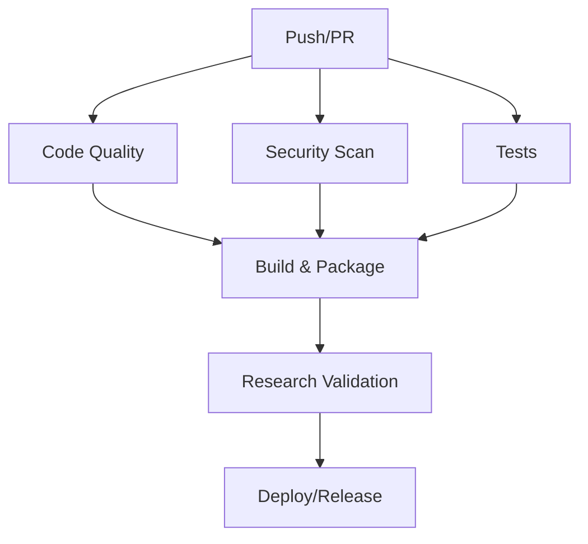

# GitHub Actions Workflow Setup

This document provides comprehensive GitHub Actions workflows for the Causal Interface Gym project. These workflows implement advanced CI/CD practices tailored for research software development.

## 🏗️ Workflow Architecture



## 📋 Required Workflows

### 1. Continuous Integration (`ci.yml`)

```yaml
name: Continuous Integration

on:
  push:
    branches: [ main, develop ]
  pull_request:
    branches: [ main ]

env:
  PYTHON_VERSION: "3.10"
  
jobs:
  code-quality:
    name: Code Quality Checks
    runs-on: ubuntu-latest
    steps:
      - uses: actions/checkout@v4
      
      - name: Set up Python
        uses: actions/setup-python@v4
        with:
          python-version: ${{ env.PYTHON_VERSION }}
          
      - name: Install dependencies
        run: |
          python -m pip install --upgrade pip
          pip install -e ".[dev]"
          
      - name: Run black formatting check
        run: black --check .
        
      - name: Run ruff linting
        run: ruff check .
        
      - name: Run mypy type checking
        run: mypy .

  security-scan:
    name: Security Scanning
    runs-on: ubuntu-latest
    steps:
      - uses: actions/checkout@v4
      
      - name: Run Bandit security linter
        uses: securecodewarrior/github-action-bandit@v1
        
      - name: Run Safety dependency check
        run: |
          pip install safety
          safety check -r requirements-dev.txt
          
      - name: Run Semgrep SAST
        uses: returntocorp/semgrep-action@v1

  test-matrix:
    name: Test Matrix
    runs-on: ${{ matrix.os }}
    strategy:
      matrix:
        os: [ubuntu-latest, macos-latest, windows-latest]
        python-version: ["3.10", "3.11", "3.12"]
        
    steps:
      - uses: actions/checkout@v4
      
      - name: Set up Python ${{ matrix.python-version }}
        uses: actions/setup-python@v4
        with:
          python-version: ${{ matrix.python-version }}
          
      - name: Install dependencies
        run: |
          python -m pip install --upgrade pip
          pip install -e ".[dev,ui]"
          
      - name: Run unit tests
        run: pytest tests/ --cov=causal_interface_gym --cov-report=xml
        
      - name: Upload coverage to Codecov
        uses: codecov/codecov-action@v3
        with:
          file: ./coverage.xml

  research-validation:
    name: Research Reproducibility
    runs-on: ubuntu-latest
    needs: [code-quality, test-matrix]
    
    steps:
      - uses: actions/checkout@v4
      
      - name: Set up Python
        uses: actions/setup-python@v4
        with:
          python-version: ${{ env.PYTHON_VERSION }}
          
      - name: Install dependencies
        run: |
          python -m pip install --upgrade pip
          pip install -e ".[dev,ui]"
          
      - name: Run reproducibility tests
        run: pytest tests/benchmarks/ --benchmark-json=benchmark.json
        
      - name: Validate causal reasoning accuracy
        run: python scripts/validate_causal_accuracy.py
        
      - name: Store benchmark results
        uses: benchmark-action/github-action-benchmark@v1
        with:
          tool: 'pytest'
          output-file-path: benchmark.json
```

### 2. Security Workflow (`security.yml`)

```yaml
name: Security

on:
  schedule:
    - cron: '0 2 * * 1'  # Weekly on Monday
  push:
    branches: [ main ]
  pull_request:
    branches: [ main ]

jobs:
  dependency-scan:
    name: Dependency Vulnerability Scan
    runs-on: ubuntu-latest
    
    steps:
      - uses: actions/checkout@v4
      
      - name: Run Trivy vulnerability scanner
        uses: aquasecurity/trivy-action@master
        with:
          scan-type: 'fs'
          scan-ref: '.'
          format: 'sarif'
          output: 'trivy-results.sarif'
          
      - name: Upload Trivy scan results
        uses: github/codeql-action/upload-sarif@v2
        with:
          sarif_file: 'trivy-results.sarif'

  container-scan:
    name: Container Security Scan
    runs-on: ubuntu-latest
    
    steps:
      - uses: actions/checkout@v4
      
      - name: Build Docker image
        run: docker build -t causal-gym:latest .
        
      - name: Run Trivy container scan
        uses: aquasecurity/trivy-action@master
        with:
          image-ref: 'causal-gym:latest'
          format: 'sarif'
          output: 'container-results.sarif'
          
      - name: Upload container scan results
        uses: github/codeql-action/upload-sarif@v2
        with:
          sarif_file: 'container-results.sarif'

  sbom-generation:
    name: Generate SBOM
    runs-on: ubuntu-latest
    
    steps:
      - uses: actions/checkout@v4
      
      - name: Generate SBOM
        uses: anchore/sbom-action@v0
        with:
          path: .
          format: spdx-json
          
      - name: Upload SBOM
        uses: actions/upload-artifact@v3
        with:
          name: sbom
          path: sbom.spdx.json
```

### 3. Release Automation (`release.yml`)

```yaml
name: Release

on:
  push:
    tags:
      - 'v*'

env:
  PYTHON_VERSION: "3.10"

jobs:
  create-release:
    name: Create Release
    runs-on: ubuntu-latest
    outputs:
      upload_url: ${{ steps.create_release.outputs.upload_url }}
      
    steps:
      - uses: actions/checkout@v4
        with:
          fetch-depth: 0
          
      - name: Generate changelog
        id: changelog
        uses: conventional-changelog/conventional-changelog-action@v3
        with:
          github-token: ${{ secrets.GITHUB_TOKEN }}
          
      - name: Create Release
        id: create_release
        uses: actions/create-release@v1
        env:
          GITHUB_TOKEN: ${{ secrets.GITHUB_TOKEN }}
        with:
          tag_name: ${{ github.ref }}
          release_name: Release ${{ github.ref }}
          body: ${{ steps.changelog.outputs.changelog }}
          draft: false
          prerelease: false

  build-and-publish:
    name: Build and Publish
    runs-on: ubuntu-latest
    needs: create-release
    
    steps:
      - uses: actions/checkout@v4
      
      - name: Set up Python
        uses: actions/setup-python@v4
        with:
          python-version: ${{ env.PYTHON_VERSION }}
          
      - name: Install build dependencies
        run: |
          python -m pip install --upgrade pip
          pip install build twine
          
      - name: Build package
        run: python -m build
        
      - name: Publish to PyPI
        env:
          TWINE_USERNAME: __token__
          TWINE_PASSWORD: ${{ secrets.PYPI_API_TOKEN }}
        run: twine upload dist/*
        
      - name: Upload release assets
        uses: actions/upload-release-asset@v1
        env:
          GITHUB_TOKEN: ${{ secrets.GITHUB_TOKEN }}
        with:
          upload_url: ${{ needs.create-release.outputs.upload_url }}
          asset_path: ./dist/
          asset_name: release-assets
          asset_content_type: application/zip

  docker-publish:
    name: Publish Docker Image
    runs-on: ubuntu-latest
    needs: create-release
    
    steps:
      - uses: actions/checkout@v4
      
      - name: Set up Docker Buildx
        uses: docker/setup-buildx-action@v2
        
      - name: Login to Docker Hub
        uses: docker/login-action@v2
        with:
          username: ${{ secrets.DOCKER_USERNAME }}
          password: ${{ secrets.DOCKER_PASSWORD }}
          
      - name: Extract metadata
        id: meta
        uses: docker/metadata-action@v4
        with:
          images: causal-interface-gym
          tags: |
            type=ref,event=tag
            type=semver,pattern={{version}}
            type=semver,pattern={{major}}.{{minor}}
            
      - name: Build and push
        uses: docker/build-push-action@v4
        with:
          context: .
          push: true
          tags: ${{ steps.meta.outputs.tags }}
          labels: ${{ steps.meta.outputs.labels }}
          target: production
```

## 🔧 Setup Instructions

### 1. Required Repository Secrets

Add these secrets to your GitHub repository settings:

```bash
# PyPI Publishing
PYPI_API_TOKEN=your_pypi_token

# Docker Publishing  
DOCKER_USERNAME=your_docker_username
DOCKER_PASSWORD=your_docker_password

# Optional: Additional integrations
CODECOV_TOKEN=your_codecov_token
SONAR_TOKEN=your_sonarcloud_token
```

### 2. Branch Protection Rules

Configure these branch protection rules for `main`:

- ✅ Require status checks to pass before merging
- ✅ Require branches to be up to date before merging
- ✅ Required status checks:
  - `code-quality`
  - `security-scan`
  - `test-matrix (ubuntu-latest, 3.10)`
  - `research-validation`
- ✅ Require review from code owners
- ✅ Dismiss stale reviews when new commits are pushed
- ✅ Require linear history

### 3. Workflow Permissions

Ensure workflows have appropriate permissions:

```yaml
permissions:
  contents: read
  security-events: write
  packages: write
  pull-requests: write
```

## 📊 Quality Gates

### Automated Quality Criteria

All workflows include these quality gates:

1. **Code Quality**: 100% pass rate for linting and formatting
2. **Type Safety**: No mypy errors allowed
3. **Test Coverage**: Minimum 80% code coverage
4. **Security**: No high/critical vulnerabilities
5. **Performance**: No >10% performance regression
6. **Research Validity**: Causal reasoning accuracy >95%

### Manual Review Requirements

- At least one code owner approval
- Research methodology validation for core changes
- Breaking change documentation
- Security review for dependency changes

## 🚀 Deployment Strategy

### Environments

1. **Development**: Auto-deploy from `develop` branch
2. **Staging**: Auto-deploy from `main` branch
3. **Production**: Manual promotion from staging

### Release Process

1. Create feature branch from `develop`
2. Implement changes with tests
3. Create PR to `develop`
4. Automated testing and validation
5. Merge to `develop` after approval
6. Create PR from `develop` to `main`
7. Final validation and approval
8. Merge to `main` triggers staging deployment
9. Tag release triggers production deployment

## 🔍 Monitoring & Alerting

### Workflow Monitoring

- Failed builds trigger Slack alerts
- Security vulnerabilities create high-priority issues
- Performance regressions block deployments
- Dependency updates automated with testing

### Research Integrity

- Reproducibility checks on every PR
- Benchmark regression detection
- Causal accuracy validation
- Results archival for audit trails

## 📝 Usage Examples

### Running Workflows Locally

```bash
# Install act for local testing
curl https://raw.githubusercontent.com/nektos/act/master/install.sh | sudo bash

# Test workflows locally
act -j code-quality
act -j test-matrix
act -j security-scan
```

### Workflow Triggers

```bash
# Trigger manual workflow run
gh workflow run ci.yml

# Trigger with specific parameters
gh workflow run release.yml -f version=1.2.3
```

This comprehensive workflow setup ensures high-quality, secure, and reproducible research software development while maintaining the rigorous standards expected in academic and research environments.