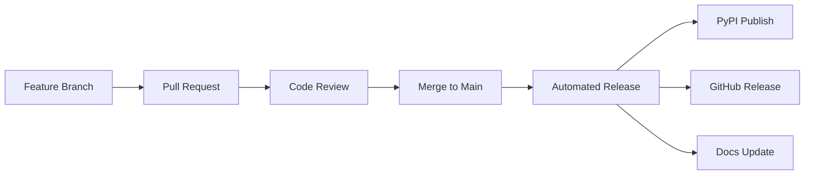

# Release Automation Guide

This document outlines the automated release process for the Causal Interface Gym project.

## Overview

The release automation system provides:
- **Semantic Versioning**: Automated version bumping based on conventional commits
- **Changelog Generation**: Automatic changelog updates
- **Build and Test**: Comprehensive testing before release
- **Package Publishing**: Automated PyPI publishing
- **GitHub Releases**: Automated GitHub release creation
- **Documentation Updates**: Automatic documentation deployment

## Release Workflow

### 1. Development Flow



### 2. Conventional Commits

Use conventional commit messages for automatic versioning:

```bash
# Feature (minor version bump)
feat: add new causal intervention UI component

# Bug fix (patch version bump)
fix: resolve memory leak in environment creation

# Breaking change (major version bump)
feat!: redesign intervention API with breaking changes

# Documentation (no version bump)
docs: update installation instructions

# Other types (no version bump)
chore: update dependencies
test: add integration tests
refactor: improve code structure
```

### 3. Version Bumping Strategy

- **Major (X.0.0)**: Breaking changes (`feat!`, `fix!`, `BREAKING CHANGE`)
- **Minor (X.Y.0)**: New features (`feat`)
- **Patch (X.Y.Z)**: Bug fixes (`fix`)

## GitHub Actions Release Workflow

### Automated Release Workflow

Create `.github/workflows/release.yml`:

```yaml
name: Release

on:
  push:
    branches: [ main ]
  workflow_dispatch:
    inputs:
      release_type:
        description: 'Release type'
        required: true
        default: 'auto'
        type: choice
        options:
        - auto
        - patch
        - minor
        - major

jobs:
  release:
    runs-on: ubuntu-latest
    if: "!contains(github.event.head_commit.message, 'skip ci')"
    
    steps:
    - uses: actions/checkout@v4
      with:
        fetch-depth: 0
        token: ${{ secrets.GITHUB_TOKEN }}
    
    - name: Set up Python
      uses: actions/setup-python@v4
      with:
        python-version: "3.11"
    
    - name: Install dependencies
      run: |
        python -m pip install --upgrade pip
        pip install semantic-release build twine
        make install-dev
    
    - name: Run tests
      run: make test
    
    - name: Run security scan
      run: ./scripts/security-scan.sh
    
    - name: Semantic Release
      uses: python-semantic-release/python-semantic-release@v7.34.6
      with:
        github_token: ${{ secrets.GITHUB_TOKEN }}
        pypi_token: ${{ secrets.PYPI_API_TOKEN }}
        
    - name: Build package
      run: python -m build
    
    - name: Publish to PyPI
      uses: pypa/gh-action-pypi-publish@release/v1
      with:
        password: ${{ secrets.PYPI_API_TOKEN }}
        skip_existing: true
    
    - name: Upload release assets
      uses: actions/upload-artifact@v3
      with:
        name: release-assets
        path: |
          dist/*.whl
          dist/*.tar.gz
          CHANGELOG.md
```

### Pre-release Workflow

Create `.github/workflows/pre-release.yml`:

```yaml
name: Pre-release

on:
  push:
    branches: [ develop ]

jobs:
  pre-release:
    runs-on: ubuntu-latest
    
    steps:
    - uses: actions/checkout@v4
    
    - name: Set up Python
      uses: actions/setup-python@v4
      with:
        python-version: "3.11"
    
    - name: Install dependencies
      run: |
        python -m pip install --upgrade pip
        make install-dev
    
    - name: Run tests
      run: make test
    
    - name: Build package
      run: python -m build
    
    - name: Create pre-release
      uses: actions/create-release@v1
      env:
        GITHUB_TOKEN: ${{ secrets.GITHUB_TOKEN }}
      with:
        tag_name: v${{ github.run_number }}-pre
        release_name: Pre-release v${{ github.run_number }}
        draft: false
        prerelease: true
```

## Semantic Release Configuration

### Configuration File

Create `.releaserc.json`:

```json
{
  "branches": [
    "main",
    {
      "name": "develop",
      "prerelease": "alpha"
    }
  ],
  "plugins": [
    "@semantic-release/commit-analyzer",
    "@semantic-release/release-notes-generator",
    [
      "@semantic-release/changelog",
      {
        "changelogFile": "CHANGELOG.md"
      }
    ],
    [
      "@semantic-release/exec",
      {
        "prepareCmd": "python scripts/update_version.py ${nextRelease.version}"
      }
    ],
    [
      "@semantic-release/git",
      {
        "assets": [
          "CHANGELOG.md",
          "pyproject.toml",
          "src/causal_interface_gym/__init__.py"
        ],
        "message": "chore(release): ${nextRelease.version} [skip ci]\n\n${nextRelease.notes}"
      }
    ],
    "@semantic-release/github"
  ],
  "preset": "conventionalcommits",
  "presetConfig": {
    "types": [
      {"type": "feat", "section": "Features"},
      {"type": "fix", "section": "Bug Fixes"},
      {"type": "perf", "section": "Performance Improvements"},
      {"type": "revert", "section": "Reverts"},
      {"type": "docs", "section": "Documentation", "hidden": false},
      {"type": "style", "section": "Styles", "hidden": true},
      {"type": "chore", "section": "Miscellaneous Chores", "hidden": true},
      {"type": "refactor", "section": "Code Refactoring", "hidden": true},
      {"type": "test", "section": "Tests", "hidden": true},
      {"type": "build", "section": "Build System", "hidden": true},
      {"type": "ci", "section": "Continuous Integration", "hidden": true}
    ]
  }
}
```

### Version Update Script

Create `scripts/update_version.py`:

```python
#!/usr/bin/env python3
"""Update version in project files."""

import sys
import re
from pathlib import Path

def update_version(new_version: str):
    """Update version in all relevant files."""
    
    # Update pyproject.toml
    pyproject_path = Path("pyproject.toml")
    if pyproject_path.exists():
        content = pyproject_path.read_text()
        content = re.sub(
            r'version = "[^"]*"',
            f'version = "{new_version}"',
            content
        )
        pyproject_path.write_text(content)
        print(f"Updated version in {pyproject_path}")
    
    # Update __init__.py
    init_path = Path("src/causal_interface_gym/__init__.py")
    if init_path.exists():
        content = init_path.read_text()
        content = re.sub(
            r'__version__ = "[^"]*"',
            f'__version__ = "{new_version}"',
            content
        )
        init_path.write_text(content)
        print(f"Updated version in {init_path}")
    
    # Update documentation conf.py if it exists
    docs_conf = Path("docs/conf.py")
    if docs_conf.exists():
        content = docs_conf.read_text()
        content = re.sub(
            r"version = '[^']*'",
            f"version = '{new_version}'",
            content
        )
        content = re.sub(
            r"release = '[^']*'",
            f"release = '{new_version}'",
            content
        )
        docs_conf.write_text(content)
        print(f"Updated version in {docs_conf}")

if __name__ == "__main__":
    if len(sys.argv) != 2:
        print("Usage: python update_version.py <new_version>")
        sys.exit(1)
    
    new_version = sys.argv[1]
    update_version(new_version)
    print(f"Version updated to {new_version}")
```

## Manual Release Process

### 1. Prepare Release

```bash
# 1. Ensure you're on main branch and up to date
git checkout main
git pull origin main

# 2. Run full test suite
make test
make lint

# 3. Run security scan
./scripts/security-scan.sh

# 4. Review and update CHANGELOG.md if needed
git add CHANGELOG.md
git commit -m "docs: update changelog for release"
```

### 2. Create Release

```bash
# 1. Tag the release
git tag -a v1.2.3 -m "Release version 1.2.3"

# 2. Push tag to trigger automated release
git push origin v1.2.3

# OR use GitHub CLI
gh release create v1.2.3 --title "Release v1.2.3" --notes-from-tag
```

### 3. Verify Release

```bash
# 1. Check PyPI upload
pip install causal-interface-gym==1.2.3

# 2. Verify GitHub release
gh release view v1.2.3

# 3. Check documentation deployment
curl -s https://causal-interface-gym.readthedocs.io/en/latest/
```

## Hotfix Release Process

### 1. Create Hotfix Branch

```bash
# 1. Create hotfix branch from main
git checkout main
git checkout -b hotfix/critical-security-fix

# 2. Make necessary fixes
# ... fix code ...

# 3. Commit with conventional commit format
git commit -m "fix!: resolve critical security vulnerability CVE-2024-XXXX"
```

### 2. Emergency Release

```bash
# 1. Push hotfix branch
git push origin hotfix/critical-security-fix

# 2. Create emergency release PR
gh pr create --title "Hotfix: Critical Security Fix" --body "Emergency security patch"

# 3. Merge and trigger automated release
gh pr merge --squash --delete-branch
```

## Release Validation

### Automated Checks

The release pipeline includes:

1. **Unit Tests**: Full test suite execution
2. **Integration Tests**: End-to-end testing
3. **Security Scan**: Vulnerability scanning
4. **Linting**: Code quality checks
5. **Build Test**: Package build verification
6. **Documentation**: Documentation build test

### Manual Verification Steps

1. **Package Installation**:
   ```bash
   pip install causal-interface-gym==X.Y.Z
   python -c "import causal_interface_gym; print(causal_interface_gym.__version__)"
   ```

2. **Basic Functionality**:
   ```bash
   python -c "
   from causal_interface_gym import CausalEnvironment
   env = CausalEnvironment.from_dag({'A': [], 'B': ['A']})
   print('Release verification: PASSED')
   "
   ```

3. **Documentation Check**:
   - Verify documentation is accessible
   - Check API documentation is updated
   - Ensure examples work with new version

## Rollback Procedures

### 1. PyPI Rollback

```bash
# Remove problematic version (if just published)
pip install twine
twine upload --repository pypi dist/* --skip-existing

# Note: PyPI doesn't allow true rollbacks, only yanking
# Users must be notified to downgrade manually
```

### 2. GitHub Release Rollback

```bash
# Delete the problematic release
gh release delete v1.2.3

# Delete the tag
git tag -d v1.2.3
git push origin :refs/tags/v1.2.3
```

### 3. Revert Changes

```bash
# Revert the release commit
git revert <release-commit-hash>
git push origin main

# Create new patch release with fix
git commit -m "fix: revert problematic changes from v1.2.3"
```

## Branch Protection and Release Gates

### Required Status Checks

Configure branch protection rules to require:

- ✅ All tests passing
- ✅ Security scan completed
- ✅ Code review approved
- ✅ Documentation updated
- ✅ Changelog updated

### Release Approval Process

For production releases:

1. **Development Team Approval**: Code review and testing
2. **Security Team Approval**: Security scan review
3. **Product Team Approval**: Feature and compatibility review
4. **Release Manager Approval**: Final release authorization

## Monitoring Release Health

### Post-Release Monitoring

- **Error Rates**: Monitor for increased error rates
- **Performance**: Check for performance regressions
- **User Feedback**: Monitor issue reports and user feedback
- **Dependencies**: Verify compatibility with dependencies

### Rollback Triggers

Automatic rollback considerations:
- Error rate > 5% increase
- Critical functionality failures
- Security vulnerabilities discovered
- Performance degradation > 50%

## Release Documentation

### Release Notes Template

```markdown
# Release v1.2.3

## 🚀 Features
- New causal intervention UI components
- Enhanced performance monitoring

## 🐛 Bug Fixes
- Fixed memory leak in environment creation
- Resolved intervention ordering issues

## 🔧 Improvements
- Updated dependencies for security
- Improved error messages

## 📚 Documentation
- Updated API documentation
- Added new examples

## ⚠️ Breaking Changes
- Renamed `old_function()` to `new_function()`
- Changed intervention API format

## 🔒 Security
- Fixed CVE-2024-XXXX vulnerability
- Updated cryptographic dependencies

## 📦 Dependencies
- Updated numpy to 1.24.0
- Added new optional dependencies

## 🔄 Migration Guide
See [MIGRATION.md](MIGRATION.md) for upgrade instructions.
```

This comprehensive release automation setup ensures reliable, secure, and traceable releases for the Causal Interface Gym project.